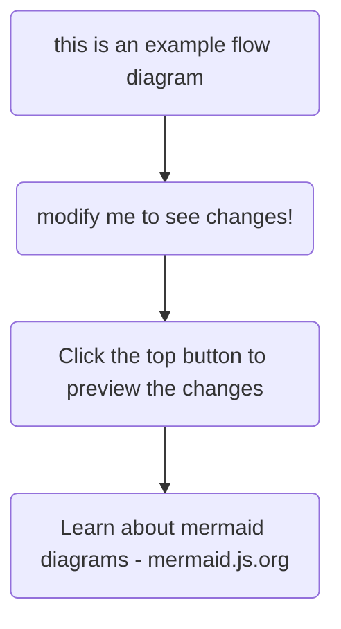

The Benefits of Language Models

1. Enhanced Content Creation:
2. Automated Content Generation: Language models can generate high-quality content, such as articles, blog posts, and product descriptions, saving time and effort.
3. Improved Writing Quality: These models can help identify grammatical errors, improve sentence structure, and suggest more engaging phrasing.
4. Personalized Content: By analyzing user preferences and behavior, language models can tailor content to individual needs, increasing engagement.

## H2

## H2 using markup

### H3 title using Markup

texttttttttt \*\*bold \*\*and this **bold** with markup, here is a [Google ](https://google.com)link
[Yahoo ](https://yahoo.com){:target="\_blank"}

